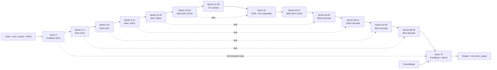

# DLSS 5 Neural Rendering 静态计算图

本文针对以下唯一二进制，不把结论外推到其他 DLSS-NR 版本：

- 文件：`DLSS.5.Visual.Enhancer.v3.0/bin/runtime/nvngx_dlssnr.dll`
- SHA-256：`6eb209e764f39872625debd6abaf45e2bb6322f6f270f781f70c059ae30b3927`
- 模型名：`hnet-vigilant-squid`
- 权重预设：`CC_Control_History_Blend_Quantize_With_Teacher_honest_tench_2026_07_04_22_30_weights`

分析全部为静态分析，没有执行 DLL。使用 Ghidra 12.1.2、PE 资源解析、ELF/Cubin 符号表及 SM86 SASS 交叉验证。机器可读结果见：

- `DLSS5-extracted/compute_graph.json`：71 个 block 的类型与连接
- `DLSS5-extracted/weights_manifest.json`：153 个权重记录
- `DLSS5-extracted/cubin_kernels.json`：15 个 Cubin 组、231 个 SM86 kernel 入口

## 结论

这个模型不是单纯的单帧 inpainting 网络，而是一个带时间历史的多尺度 encoder/decoder：四级 fused Swin encoder，Split-Swin 与 1024 通道 ViT 瓶颈，再通过对称 skip connection 解码。静态 core 图的 block0 直接输入是单张 RGB texture；Color、上一帧输出和运动矢量如何在外围组装成该 RGB 输入，属于 Feature/temporal 接线，不把它们误写成 cubin 内部的额外 channel。

一个需要特别更正的结论是：该 DLL 的 Feature 参数解析器确实读取 `DLSSNR.Depth`，但 `CG2RNetworkManager::Evaluate` 没有访问保存 Depth 的字段，并在核心网络输入设置调用中把相应槽位传为 `0`。因此，对这个确切 DLL 而言，Depth 是“ABI 接受但神经核心未消费”的输入，不能把它列为该模型的必要神经条件。

## Feature API 输入与输出

### 逐帧资源

| 字段 | 必需性 | 进入位置 | 静态结论 |
|---|---:|---|---|
| `DLSSNR.Color` | 必需 | pre-block / encoder | 当前颜色；缺少 Color 会直接跳过 Evaluate。支持独立 Subrect。 |
| `DLSSNR.Output` | 必需 | 输出目标 | 同尺寸增强颜色；缺少 Output 会直接跳过 Evaluate。支持独立 Subrect。 |
| `DLSSNR.MVec` | 时间模式需要 | pre-block / temporal input | 与内部 `prev_output` 一起提供时间对应；有 Subrect 和 `MVecScaleX/Y`。无有效历史、Reset 或缺少 MV 时会走降级路径。 |
| `DLSSNR.ControlMask` | 可选 | block 70 post-block | 只取标量纹理 R 分量，控制最终神经输出混合；不作为 encoder 条件。传入时 `UseAutoMask` 被强制关闭。 |
| `DLSSNR.Depth` | ABI 可选 | 本版本未进入核心图 | 参数和 Subrect 会被读取，但核心 Evaluate 不访问 Depth 资源字段；不能依赖它改变本版本神经推理。 |
| `DLSSNR.UI` / `UIAlpha` / `Backbuffer` | 可选 | Feature 外围合成 | 用于 UI correction、原色快照或最终合成，不属于 71-block Transformer 主干。 |
| `DLSSNR.BidirectionalDistortionField` | 可选 | Feature 外围路径 | 参数存在；没有证据表明它进入主干 block。 |

内部还维护两张不是调用者提交的资源：

| 内部资源 | 格式 | 作用 |
|---|---|---|
| `dlssnr_prev_output` | RGBA16F | 上一帧网络输出，作为下一帧直接时间输入；Reset、尺寸或控制状态变化时清空。 |
| `dlssnr_network_output_scratch` | RGBA16F | 当输出别名、后处理或合成路径需要时承接核心输出。 |

`Reset`、`DepthInverted`、`Intensity`、`Style`、`LocalToneStrength`、`LocalStructureStrength`、`SkinStructureStrength`、`UseAutoMask` 和 `ScalingRatio` 是标量控制。`DepthInverted` 虽被传入设置流程，但由于本版本没有消费 Depth 纹理，不能据此推导 Depth 参与了神经特征。

### 输出

对外只有一张 `DLSSNR.Output` 颜色纹理，不输出 depth、motion vector、置信度或 mask。核心 post-block 可先写入 RGBA16F scratch，随后由 `cg2r_post_process_kernel` 或 `cg2r_copy_kernel` 写入最终 Output，并更新 `prev_output`。

## 主计算图



### Block 分组

| Block | 类型 | 通道/角色 | 输入关系 |
|---:|---|---|---|
| 0 | `CCTinlayoutFusedPreBlockSwin1H`，downsample | RGB texture → fused 32ch → 32 | 网络 `rgb` 是外部纹理；kernel 内先做 texture feature front-end，再进入 32-channel body；output 0 继续编码，output 1 留作 block 70 skip。 |
| 1–3 | `CCTinlayoutFusedSwin1H` | 32 | 顺序连接。 |
| 4 | Swin1H downsample | 32 → 64 | output 0 进入 block 5；output 1 供 block 66。 |
| 5–7 | `CCTinlayoutFusedSwin2H` | 64 | 顺序连接。 |
| 8 | Swin2H downsample | 64 → 128 | output 1 供 block 62。 |
| 9–13 | `CCTinlayoutFusedSwin4H` | 128 | 顺序连接。 |
| 14 | Swin4H downsample | 128 → 256 | output 1 供 block 56。 |
| 15–21 | `CCTinlayoutFusedSwin8H` | 256 | 顺序连接。 |
| 22 | Swin8H downsample | 256 → 512 | output 1 供 block 48。 |
| 23–30 | `CCSplitSwin16HBlock` | 512 | 8 个 block；block 30 的 `ProjPool` 产生 pooled 主分支和 full-resolution skip，随后 `FinalHead` 变成 ViT 的 1024 通道输入。 |
| 31–38 | `CCVit1DBlock` 或 `CCVitBlock` | 1024 | 工厂按布局变体选择；两套 kernel 都在 DLL 中。每个 block 含 5 个子层。 |
| 39 | `CCDecInputUpsample` | 1024 → 512 | main=`block38.out0`，skip=`block30.out1`。 |
| 40–47 | `CCSplitSwin16HBlock` | 512 | 8 个 decoder block。 |
| 48 | Swin8H upsample | 512 + 256 → 256 | main=`block47.out0`，skip=`block22.out1`。 |
| 49–55 | `CCTinlayoutFusedSwin8H` | 256 | 顺序连接。 |
| 56 | Swin4H upsample | 256 + 128 → 128 | main=`block55.out0`，skip=`block14.out1`。 |
| 57–61 | `CCTinlayoutFusedSwin4H` | 128 | 顺序连接。 |
| 62 | Swin2H upsample | 128 + 64 → 64 | main=`block61.out0`，skip=`block8.out1`。 |
| 63–65 | `CCTinlayoutFusedSwin2H` | 64 | 顺序连接。 |
| 66 | Swin1H upsample | 64 + 32 → 32 | main=`block65.out0`，skip=`block4.out1`。 |
| 67–69 | `CCTinlayoutFusedSwin1H` | 32 | 顺序连接。 |
| 70 | `CCTinlayoutFusedPostBlockSwin1H` | 32 + enc0 skip(32) → RGB | main=`block69.out0`，skip=`block0.out1`；`block0.out1` 是 pre 的 full-resolution 32-channel 输出，不是原始 RGB；应用 `blend_scale` 和可选 ControlMask。 |

`_ds` block 同时输出继续下采样的 output 0 和保留给 decoder 的 output 1；所有显式双输入连接都在工厂函数 `0x180039780` 中以 block index 和 output index 构造。具体每一级的边界 padding 和 tile 对齐由 fused kernel 实现，不能仅凭名称等同于某个 PyTorch `interpolate` 参数。

### Block 内部算子

Cubin 与主机端 layer 构造代码共同确认了以下算子族：

- Pre block 另有 fused texture front-end：host op 列表为 `mul → ones_like → detach → cat → cat → convolution`，kernel 开头也有 `TEX` 和 feature-tile 写入。1024-byte 前缀是该 front-end 输出之后的完整 `32×32` raw E4M3 payload，不能直接按 RGB 的 `32×3` 行主序矩阵解释；其 tensor-core storage permutation 仍未恢复。随后 `_ds` output0 是无参数 2×2/stride-2 pool，output1 保留 full-resolution tensor。其后是无额外 LayerNorm 的 C32 Swin：FFN 使用 `MpCubicSiluActivation`，再做 QKV、Q/K 向量归一化、per-head FP32 cosine scale、cosine attention、softmax、值聚合、输出投影和残差。
- 其余 fused Swin：无额外 LayerNorm；FFN 使用 `MpCubicSiluActivation`，再做 QKV、Q/K 向量归一化、per-head FP32 cosine scale、cosine attention、softmax、值聚合、输出投影和残差；包含 shifted/non-shifted 版本。
- Split-Swin 512：两条 `512→512` FFN 支路，其中一条经过 `MpCubicSiLU` 后与另一条逐元素相乘，再经 `FFwdProj(residual scale)`；随后是 `QKVAttn → Proj/ProjPool(residual scale)`。最后一个 encoder block 的 `ProjPool` 产出全分辨率 512 通道 residual 和固定 2×2 pooled 512 通道分支，单个 `512→1024` pointwise `FinalHead` 作用于 pooled 分支；前者作为 output 1 decoder skip，后者作为 output 0 的 ViT 输入。
- ViT 1024：`FFN Expand(1024→4096) → MpCubicSiLU → FFN Contract(4096→1024) → QKV(Q/K normalize × sqrt(32)) → layer3 score scalar → 自定义 exp/reciprocal attention → Projection`；另有 1D/2D repack 变体。
- Decoder：`CCDecInputUpsample` 和四级 Swin upsample，将主分支与对应 encoder output 1 合并。
- Post-block：先执行 `main_depthwise_projection + enc0_skip * inp_upsample_input_scale`，再走 C32 Swin body 和 RGB 输出卷积；最后执行普通 blend、simple blend 或 ControlMask blend。原始 RGB 是外围 blend 的 base，不是 post 的第二个 core tensor。

这些是逻辑算子。Cubin 中的 `chained`、`wait`、`tilesync`、`inpview`、`outview`、`full_rect`、`fp8` 是同一逻辑层的执行变体，不是每帧都顺序执行的额外网络层。

## ControlMask 的确切位置

block 70 同时包含普通 post-block、simple-blend 和 control-mask kernel。SM86 SASS 的 control-mask 分支等价于：

```text
mask = sample(ControlMask).r
effective_blend = saturate(mask * blend_scale)
Output = neural_result + effective_blend * (base_result - neural_result)
```

因此 ControlMask：

- 不改变 block 0–69 产生的神经特征；
- 不告诉网络“这里是洞，请生成未知背景”；
- 只控制最终各像素采用多少已经计算出的 neural result；
- `0` 选择 neural result；`1` 选择由全局 `blend_scale` 限制的 base/neural 混合结果。

## 权重包

`WEIGHTS_HT.bin` 是可顺序解析的自定义 tensor map，不是 ONNX：

- 序列化大小：147,695,410 bytes
- 记录数：153
- 顶层 block：71（`block0`–`block70`）
- 原始 tensor 数据：147,683,778 bytes
- 两字节元素：73,841,889 个
- 所有记录满足 `data_size == element_count × 2`；格式枚举值为 0，结合 kernel 和加载代码推断为 FP16 容器，但枚举名称未保留在二进制中。

记录分布与计算图完全吻合：46 个 block 各有 1 个 fused layer blob，15 个 Split-Swin block 各有 4 个，8 个 ViT block 各有 5 个，block 30 有 5 个，block 70 有主 layer blob 加一个单元素 `blend_scale`。这些记录是融合层权重包，不应直接假设为单个二维矩阵。

## Cubin 对应关系

| Fatbin | SM86 入口数 | 主要内容 |
|---:|---:|---|
| 00 | 38 | Swin1H 32、pre-block、post-block、ControlMask/simple-blend |
| 01 | 24 | Swin2H 64 |
| 02 | 24 | Swin4H 128 |
| 03 | 24 | Swin8H 256 |
| 04 | 46 | Split-Swin16H 512：QKV、projection/pool、FFN、final head |
| 05 | 62 | ViT/ViT1D 1024、FFN 4096、repack |
| 06 | 5 | 1024→512 decoder input upsample、CB clear |
| 07–12 | 各 1 | 字体/捕获/MV dilation/buffer view/clear 等外围工具 kernel |
| 13 | 1 | `cg2r_post_process_kernel` |
| 14 | 1 | `cg2r_copy_kernel` |

每个 Fatbin 都提供 SM75、SM86、SM89、SM120 Cubin。231 是 SM86 文件中的可选入口总数，不是一次推理的 dispatch 数；运行时会按精度、矩形覆盖、shift、同步方式和 GPU 架构选择其中一部分。

## 已确认边界

已经恢复的是 Feature 资源接口、71-block DAG、skip 的 block/output index、层类型、通道族、主要 fused blob 的矩阵 shape/offset、FP32 per-head attention scale、pre 的完整 32×32 input-prefix tile、`MpCubicSiLU`、ProjPool 的 pooled/full 双分支、FinalHead 的 pointwise/skip 分支、post 的输入 residual fusion、post tail 的 `out_gain + out_conv_weight` 分段和 Cubin kernel 集合。尚未恢复的部分包括 pre texture front-end 的 `cat/ones_like/detach` 数值组装、down/up 的精确空间重排、ViT 的 half2 exp 近似、post output tile 的 tensor-core row/lane swizzle 与 out_gain consumer、tile 调度选择条件以及 FP8 量化比例；pre weight2 的 4 个非法 E4M3 槽目前以零 fallback。可运行的 PyTorch 参考实现位于 `tools/dlss5_pytorch.py`；要达到 bit-exact，还需要用 DLL 输出继续做数值对齐。

## 复现

运行以下命令可重新解析提取结果并验证计数：

```bash
python3 tools/analyze_dlssnr_graph.py DLSS5-extracted
```

脚本会重新生成三个 JSON 清单，并检查资源总长、每条记录边界、两字节元素数量和 block 0–70 的连续性。
