# Native DLSS5 image experiments

This report records the first concrete image cases generated by
`tools/experiments/run_dlss5_image_cases.py`. The runner used a locally
prepared `dlss5_eval.exe`, 256x256 frames, linear RGBA16F color, synthetic
R32F depth planes, and RG16F motion planes. The native runtime binary is not
stored in this repository.

The complete machine-readable result is
[`examples/cases/native/manifest.json`](../examples/cases/native/manifest.json).
Input provenance and hashes are in
[`examples/assets/download_manifest.json`](../examples/assets/download_manifest.json)
and [`examples/assets/SOURCES.md`](../examples/assets/SOURCES.md).

## Input/output examples

The left column is the normalized sRGB input; the right column is the native
output converted from linear RGB to sRGB for display. These are visual
examples, not ground-truth reconstructions.

| case | input | native output |
|---|---|---|
| Blue Marble / natural scene |  | 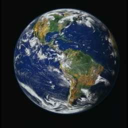 |
| Scenic landscape / soft edges | 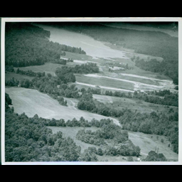 | 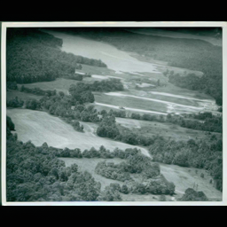 |
| Stone texture / high frequency | 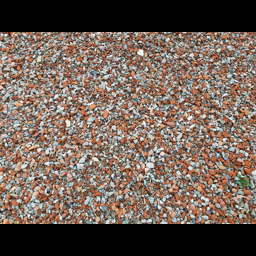 | 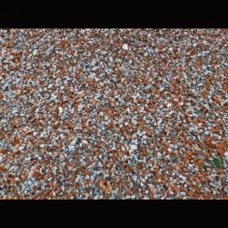 |
| Portrait / low-frequency subject |  | 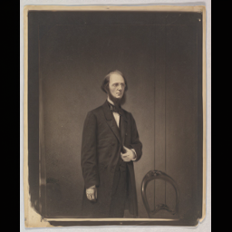 |

The output remains strongly correlated with the input, but the high-frequency
stone case receives the largest change. The native result is not a generic
pixelwise color transform: its local detail, temporal state, and host contract
all matter.

## Static content sensitivity

Metrics compare the native output with the linear-light input. `MAE` and
`RMSE` are per RGB sample in `[0,1]`; correlation measures structure retained.

| input | MAE | RMSE | correlation | changed fraction |
|---|---:|---:|---:|---:|
| Blue Marble | 0.0241 | 0.0603 | 0.9827 | 50.6% |
| Scenic landscape | 0.0108 | 0.0164 | 0.9978 | 77.4% |
| Stone texture | 0.0458 | 0.0693 | 0.9894 | 94.7% |
| Portrait | 0.0095 | 0.0225 | 99.2% | 68.4% |

The stone texture has the greatest absolute change and almost every pixel is
affected. The landscape and portrait preserve global structure more closely.
This supports treating edges, fine texture, and high-frequency material detail
as the first sensitivity targets for future inpainting/depth experiments.

## What does motion vector do?

For this test, frame 0 was Blue Marble and frame 1 was a version shifted right
by 8 pixels. The color/depth inputs were held fixed while the horizontal
motion vector supplied to the native harness was changed. The diff preview is
amplified 8x so small linear-light differences are visible.

| vector supplied | MAE vs zero-vector result | RMSE | changed fraction |
|---:|---:|---:|---:|
| +1 px | 0.00395 | 0.01053 | 39.1% |
| +4 px | 0.00595 | 0.01724 | 40.8% |
| +8 px | 0.00527 | 0.01536 | 39.1% |
| +16 px | 0.00601 | 0.01713 | 40.8% |

| zero vector | supplied vector | amplified absolute difference |
|---|---|---|
| 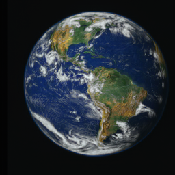 |  | 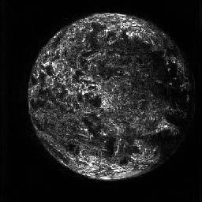 |

The response is not monotonic in vector magnitude because the vector changes
which history samples are valid; it is not a strength parameter. In a real
renderer the vector should describe the motion of the current pixel between
frames, with the host's exact sign, scale, jitter, and coordinate convention.
Using zero vectors for moving content can therefore produce stale history,
ghosting, or incorrect rejection decisions.

## History sensitivity

The current frame was Scenic landscape. One run started with Blue Marble as a
previous frame; the control run reset directly to Scenic landscape. The
history-carrying result differs by MAE `0.01312`, RMSE `0.03732`, with 74.1%
of RGB samples changing above `1e-3`.

| history-seeded run | isolated current run | amplified difference |
|---|---|---|
| 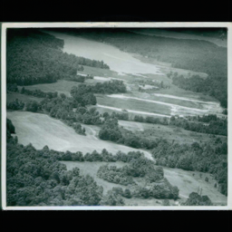 | 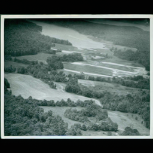 | 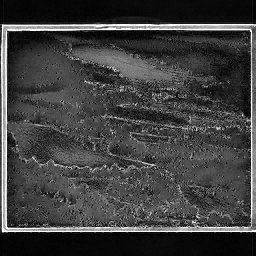 |

This is why a single-frame image-to-image wrapper must either reset history
explicitly or maintain a documented temporal state object. The native model is
not purely a stateless function of one RGB image.

## Depth sensitivity in this contract

For Blue Marble, Stone texture, and Portrait, the `depth_luma` proxy was
compared with an all-ones `depth_flat` plane. All three A/B output differences
were exactly zero in the recorded native outputs. The proxy used here is shown
below; it is not a learned depth map.

| depth proxy | flat depth | amplified difference |
|---|---|---|
| 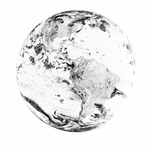 |  |  |

The correct conclusion is limited: depth was not observably consumed by this
particular native harness/Feature18 setup under these controlled inputs. It is
not permission to remove depth from the future API, because a different host,
model mode, or depth binding may exercise it. A future depth-estimator study
should first validate descriptor binding with an intentionally extreme depth
pattern and then compare native output and intermediate resource telemetry.

## Reproduce

```powershell
python tools\experiments\download_public_examples.py
python tools\experiments\run_dlss5_image_cases.py `
  --harness C:\path\to\dlss5_eval.exe --width 256 --height 256
```

The runner stores raw contracts under ignored `examples/.work/`, keeps PNG
previews and the JSON manifest under `examples/cases/native/`, and records
relative paths so the report remains portable across machines.
