# DLSS5 stereo hole-filling experiment

This experiment implements the flow described in [`PLAN.md`](PLAN.md):

```text
Left RGB + relative depth
  -> forward splat / Z-buffer
  -> RightWarpedColor + RightDepth + SourceMap + HoleMask + RightMVec
  -> simple nearest-pixel prefill
  -> DLSS5: Left(reset=1) -> Right(reset=0)
```

The depth maps are produced by the official
[Distill-Any-Depth small checkpoint](https://huggingface.co/xingyang1/Distill-Any-Depth-Small-hf),
which is a 24.8M-parameter relative-depth model based on DAv2. Its model card
shows the Transformers loading and post-processing path; the official source
repository and paper are [Westlake-AGI-Lab/Distill-Any-Depth](https://github.com/Westlake-AGI-Lab/Distill-Any-Depth)
and [arXiv:2502.19204](https://arxiv.org/abs/2502.19204).

The experiment uses relative depth as a controlled disparity proxy, not as
metric stereo depth. For each left pixel:

```text
disparity = 0.5 + 16.0 * normalized_depth
right_x   = round(left_x - disparity)
RightMVec = left_x - right_x
```

Multiple sources landing on one right pixel are resolved by a max-depth
Z-buffer. Invalid target pixels become `HoleMask=1`; the simple baseline fills
them with the nearest valid pixel on the same scanline.

## Predicted-depth image cases

The following cases use Distill-Any-Depth small output. The stock native run
uses a constant `ControlMask=0`; a separate temporary native harness was also
patched to accept the spatial `valid=255 / hole=0` R8 mask.

| case | hole fraction | disparity range | DLSS5 vs simple inside holes |
|---|---:|---:|---:|
| Blue Marble | 5.20% | 0.5..16.5 px | MAE 0.0193 |
| Portrait | 10.73% | 0.5..16.5 px | MAE 0.0157 |

| input/depth | RightWarpedColor | simple prefill | DLSS5 output |
|---|---|---|---|
| 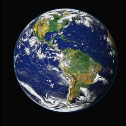<br>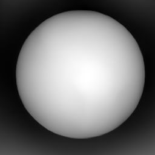 | 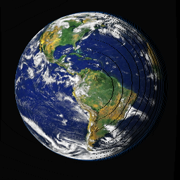 | 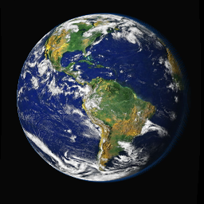 | 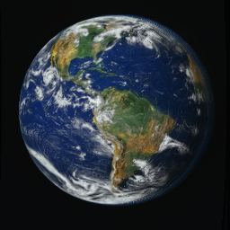 |
| 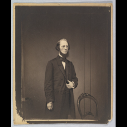<br>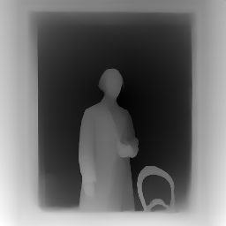 | 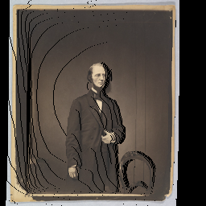 | 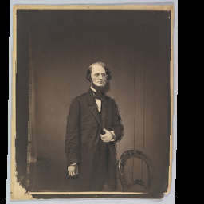 | 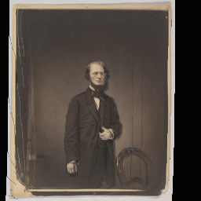 |

These cases do not have a true right-eye ground truth: the pixels exposed by
stereo disocclusion were not present in the source image. Therefore the
measured DLSS5-vs-simple difference proves that DLSS5 changes the result, but
does not prove that the change is correct. The hole masks are available here:

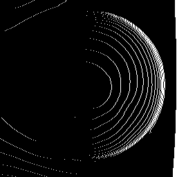
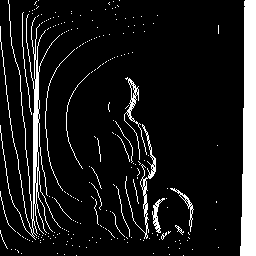

## Planar oracle case

To obtain a falsifiable image-quality comparison, the stone texture is treated
as a horizontally periodic planar texture. The complete right-eye reference is
then known as `roll(left, -16)`, while the forward splat still creates a 16-pixel
edge hole. This is a valid test of translation-hole filling, but it is not a
claim about genuinely unseen background behind an occluder.

| method | all-pixel MAE | hole-only MAE | hole-only RMSE |
|---|---:|---:|---:|
| simple nearest-pixel fill | 0.00951 | 0.15212 | 0.22606 |
| DLSS5, constant mask=0 | 0.05010 | 0.13797 | 0.20850 |

The DLSS5 hole MAE improves by `0.01415` (about `9.3%` relative), but the
all-pixel MAE becomes about `5.3x` worse. In other words, native DLSS5 shows a
small positive effect in the known hole region while globally changing valid
pixels enough to make the complete result worse.

| simple fill | known right-eye reference | DLSS5 output |
|---|---|---|
| 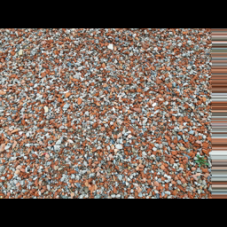 | 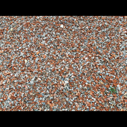 | 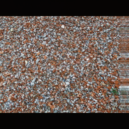 |

| simple error, amplified | DLSS5 error, amplified | hole mask |
|---|---|---|
| 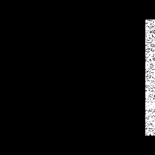 | 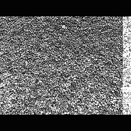 | 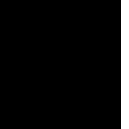 |

## ControlMask result

The same planar case was run with constant `mask=0`, constant `mask=255`, and a
per-pixel spatial mask:

```text
spatial_mask_vs_constant255 MAE  = 0.0
spatial_mask_vs_constant255 RMSE = 0.0
spatial_mask_vs_constant255 max  = 0.0
```

The full probe is recorded in
[`spatial_mask_probe.json`](../examples/cases/stereo_inpainting/spatial_mask_probe.json).
The per-pixel mask was accepted and uploaded, but the output was still exactly
the same as constant `mask=255`. Therefore the current native harness/runtime
combination does not expose a working spatial ControlMask effect in this
experiment. The measured planar improvement cannot be attributed to selective
HoleMask gating.

## Conclusion

The result is mixed, not a proof of a general DLSS5 inpainting capability:

1. Geometry plus Distill-Any-Depth small can create a reproducible stereo
   `HoleMask` and `RightMVec`; the predicted-depth cases produce 5..11% holes
   at the chosen disparity range.
2. DLSS5 changes the right-eye image and gives a modest `9.3%` hole-only MAE
   improvement in the planar oracle.
3. The same DLSS5 run worsens full-image error substantially. Even after adding
   a temporary spatial mask-file harness, the mask had no observable effect, so
   the neural change cannot currently be restricted to the hole region.
4. For genuinely unseen disoccluded backgrounds there is no ground truth in a
   monocular source image, so no positive claim is justified yet. The current
   evidence supports “possibly useful as a local texture repair after proper
   masking”, not “DLSS5 solves stereo hole filling”.

The next decisive experiment is to validate the ControlMask parameter binding
with launch/resource telemetry and add a layered synthetic scene with a known
background behind a foreground occluder. If the correctly bound masked DLSS
result still fails that oracle, the correct conclusion will be that DLSS5
provides no useful stereo-hole benefit for this application.

## Reproduce

```powershell
python tools\experiments\run_distill_any_depth_small.py --device cuda
python tools\experiments\run_stereo_inpainting_cases.py `
  --harness C:\path\to\dlss5_eval.exe `
  --max-disparity 16 --plane-shift 16
```

The generated numeric data is in
[`examples/cases/stereo_inpainting/manifest.json`](../examples/cases/stereo_inpainting/manifest.json).
