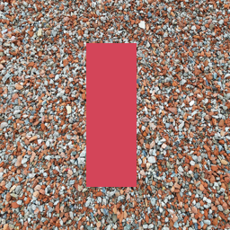
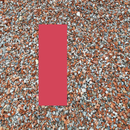
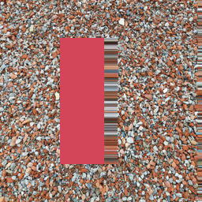
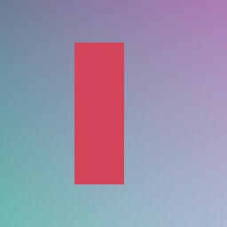

# Stereo V2：内部遮挡实验

本轮完成 V2 第一阶段的几何参考实现、逐帧 MOTION 协议和六组真实内部遮挡 oracle。以下为整个 native carrier 的效果，包含 DLAA、RenoDX 和 Feature18；尚未分离 Feature18 单独贡献。

## 设置

RTX 5080，驱动 616.64；256×256；背景视差 4 px，矩形前景视差分别为 12/20 px。右眼直接从完整背景和前景层独立渲染。补洞程序只访问左眼颜色、可见深度和投影结果，隐藏背景只用于评价。

内部新露出区域分别为 160×8、160×16 像素；画面右边缘外推另外统计。几何测试确认可见区与真值一致、MV 指向实际左眼来源、近表面遮挡远表面。每个 native session 的左眼 reset 帧使用零 MV，右眼使用逐帧上传的几何 MV。另设当前右眼单帧 reset 控制。

## 内部洞区 MAE（线性 RGB）

| 材质/洞宽 | 最近邻 | 背景侧预填充 | 背景侧 + 跨眼 DLSS5 | 背景侧 + 单帧 DLSS5 |
|---|---:|---:|---:|---:|
| 平滑/8 | .168476 | .002437 | .008290 | .006638 |
| 平滑/16 | .169392 | .004604 | .008931 | .010690 |
| 条纹/8 | .106667 | .100000 | .104184 | .105567 |
| 条纹/16 | .156667 | .116667 | .122853 | .121342 |
| 石材/8 | .207079 | .203436 | .189486 | .191842 |
| 石材/16 | .210129 | .203822 | .188213 | .191428 |

DLSS5 相对背景侧预填充在石材两例降低约 6.9%/7.7% 误差，在其余四例增加误差。局部合成在内部洞使用 carrier 输出，其余区域保留预填充，因此可信可见区保持不变。该选择是外部后处理，不是 native ControlMask。

指标改善没有消除视觉瑕疵：石材仍保留明显横向条纹；MAE 降低可能部分来自平滑或色调变化。不能仅凭误差下降宣称纹理恢复正确，也不能用当前六例真值来为每张图挑最优开关并称之为自动置信度。

| 石材/16 左眼 | 右眼真值 | 背景侧预填充 | 局部跨眼 DLSS5 |
|---|---|---|---|
|  |  |  |  |

| 平滑/8 真值 | 最近邻 | 背景侧预填充 | 局部跨眼 DLSS5 |
|---|---|---|---|
|  |  |  |  |

## MV 对照

左眼内容左移 8 px，理论 current-to-previous 为 +8。重叠区 MAE：零 MV `.079815`、+8 `.030289`、-8 `.079359`。支持 +8 的几何方向；该指标包含外观变化，尚不是逐个 native 采样位置的证明。输入从 CPU 文件经 MOTION 命令上传、按 fence 等待，但尚未新增 GPU 输入回读。

## 下一步决策

背景侧预填充作为新的基本路径。DLSS5 局部修复保留为可选候选，默认不为所有材质开启。后续实现共享背景纹理补全，再比较分眼前的共享 DLSS5 增强，并使用独立场景开发置信度门控。真实视频缓存、亚像素几何、Feature18 开关消融和性能分项仍未完成。

完整数据：[metrics.json](../examples/cases/stereo_v2/layered/metrics.json)、[MV 对照](../examples/cases/stereo_v2/layered/motion_calibration.json)。每组目录保留 raw/local、reset/history 全部图像。

## 重跑

```powershell
cmake -S tools/stereo_harness -B .native-build/stereo-v2 -A x64
cmake --build .native-build/stereo-v2 --config Release
# 将本机已验证的 DLSS/ReShade/RenoDX DLL 和 ReShade.ini 放在 exe 旁
python tools/experiments/stereo_v2/test_geometry.py
python tools/experiments/stereo_v2/run.py --harness .native-build/stereo-v2/Release/dlss5_stereo_eval.exe
python tools/experiments/stereo_v2/calibrate_motion.py --harness .native-build/stereo-v2/Release/dlss5_stereo_eval.exe
```

CMake 从固定 submodule 生成扩展源码，不改第三方源树。默认不携带 native mask 参数。安装 Python 包及 research/depth 依赖后运行；本轮沿用已有深度实验，oracle 使用解析深度以隔离深度估计误差。
